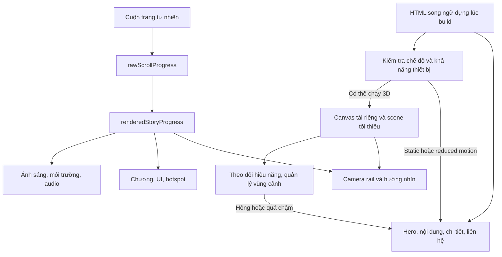

# HavenArt — Kế hoạch tổng thể

Ngày: 27/09/2026. Trạng thái: **bản đề xuất để rà soát trước triển khai**.

Cập nhật 28/09/2026: có [bộ giao việc nhiều agent](agents/TASK_BOARD.md), [hợp đồng](agents/CONTRACTS.md), [quy trình tích hợp](agents/ORCHESTRATION.md) và [rubric review](agents/REVIEW_RUBRIC.md). 20 task cũ được phân rã thành 30 gói Phase 1 và 6 gói Phase 2; các gói Phase 2 chờ refine hợp đồng sau Phase 1. Đây là quy trình đã được mô tả và kiểm tra cấu trúc, chưa phải hệ agent đã chạy ứng dụng thành công.

Yêu cầu hiện tại là lập kế hoạch. Bộ tài liệu này chuyển [master brief](reference/HAVENART_MASTER_BUILD_PROMPT.md) thành thiết kế hệ thống, lịch thực hiện và tiêu chí nghiệm thu; chưa triển khai ứng dụng. Các mục 41–42 trong brief được hiểu là chỉ dẫn cho đợt triển khai sau. Thư mục ban đầu trống, chưa có Git, mã nguồn, asset hoặc số đo hiệu năng.

## 1. Kết quả cần đạt

HavenArt giúp chủ nhà Việt Nam cảm nhận tư duy thiết kế qua một chuyến tham quan kiến trúc điều khiển bằng cuộn trang. Kết quả kinh doanh cần hướng đến là cuộc trao đổi tư vấn phù hợp; việc nhấn Zalo chỉ là tín hiệu liên hệ, chưa phải khách hàng tiềm năng đã được xác nhận.

Phase 1 phải là một sản phẩm nhỏ nhưng hoàn chỉnh: có mở đầu, vào nhà liên tục, phòng khách thuyết phục, ít nhất ba chi tiết tương tác, vườn lúc chạng vạng, và lời mời liên hệ. Camera, nội dung, ánh sáng, chất lượng và trạng thái tải đều dùng các hệ thống có thể mở rộng.

## 2. Ba phương án và lựa chọn đề xuất

| Phương án | Lợi ích | Đánh đổi | Kết luận |
|---|---|---|---|
| A. 3D thời gian thực bằng các khối kiến trúc mô-đun, HTML đầy đủ bên dưới | Đúng trải nghiệm camera/hotspot, không chờ villa GLB, giữ ngân sách asset | Cần đầu tư bố cục, ánh sáng và tối ưu GPU | **Đề xuất chọn** |
| B. Phim/chuỗi ảnh render sẵn, gắn hotspot theo thời gian | Kiểm soát hình ảnh, chi phí GPU thấp | Dung lượng truyền lớn, tương tác và thay vật thể hạn chế; không đáp ứng đầy đủ engine 3D của brief | Chỉ cân nhắc riêng cho poster hoặc chế độ tĩnh |
| C. Hoàn thiện toàn bộ villa GLB chất lượng cao trước | Có thể tạo hình ảnh thuyết phục sớm khi đã có artist/asset | Rủi ro kéo dài modeling, nặng máy, chậm kiểm chứng camera và chuyển đổi | Đưa chất lượng asset cao hơn vào đợt nâng cấp |

Lựa chọn A tách chất lượng hệ thống khỏi mức độ chi tiết đồ nội thất. Hình học có thể đơn giản ở đợt đầu; tỷ lệ nhà, đường đi, vật liệu và ánh sáng vẫn phải có chủ đích. Không coi nhà concept là dự án khách hàng đã thi công.

## 3. Phạm vi

| Bắt buộc Phase 1 | Phase 2 | Chưa đưa vào hai giai đoạn này |
|---|---|---|
| Exterior, approach, entrance, living, garden, finale | Kitchen/dining, courtyard, bedroom, bathroom, workspace, balcony | CMS, đăng nhập, CRM, báo giá tự động |
| Spline camera, cuộn tới/lùi, story data, ánh sáng liên tục | Mở rộng data/rail và asset theo hợp đồng sẵn có | VR, WebGPU bắt buộc, tour tự do WASD |
| /vi, /en; HTML ngữ nghĩa; 3+ hotspot | Thêm story, hotspot, audio và chất lượng asset từng phòng | Cửa hàng nội thất, giỏ hàng, danh mục sản phẩm |
| Poster, tải tăng dần, adaptive quality, mobile | Kiểm thử lại toàn hành trình và ngân sách tải | Form đầy đủ và backend lưu khách hàng |
| Reduced motion, WebGL fallback, audio tùy chọn | Bổ sung ảnh tĩnh cho sáu chương mới | Analytics trả phí, chatbot bán hàng |
| CTA thật, SEO, sự kiện nội bộ, license, bàn giao | Tinh chỉnh bằng dữ liệu sử dụng nếu có | Hiệu ứng nặng chỉ để trang trí |

Audio có trong kế hoạch Phase 1 nhưng luôn tắt ban đầu. Không có file âm thanh có giấy phép rõ ràng thì giữ bản tắt tiếng, ghi nhận thiếu hạng mục để quyết định trước nghiệm thu; không tải file bất kỳ cho đủ tính năng.

## 4. Các giả định công khai

1. Một lập trình viên có kinh nghiệm frontend/Three.js làm chính, có AI hỗ trợ; chủ dự án hoặc kiến trúc sư góp ý 2–3 giờ/tuần. Nếu chưa có năng lực 3D, cần ước lượng lại sau prototype camera.
2. Ngôi nhà là thiết kế concept nguyên gốc. Chưa có mặt bằng thực tế để chuyển đổi; lấy tầng chính liên thông làm điểm xuất phát, Phase 2 bổ sung tầng/ban công cùng tuyến di chuyển hợp lý.
3. 0 USD là ràng buộc mua asset/phụ thuộc/dịch vụ bắt buộc. Không đồng nghĩa công lao động, tên miền, máy thử và vận hành không có chi phí.
4. Thiết kế ưu tiên desktop nhưng không cắt nội dung ở mobile hay chế độ tĩnh. Không ép điện thoại yếu chạy 3D.
5. Các liên hệ, quyền sử dụng logo, domain sản xuất, thông tin doanh nghiệp và nội dung dịch vụ phải do chủ dự án xác nhận trước phát hành.
6. Chưa có ngày ra mắt cố định. Lịch dưới đây là ước lượng từ khi bắt đầu thực hiện, không phải cam kết ngày giao.

## 5. Kiến trúc đề xuất

HTML là nội dung gốc. Canvas là lớp tăng cường, tải riêng trong client boundary. Chỉ một vòng cập nhật sở hữu `renderedStoryProgress`; camera, chương, ánh sáng và âm thanh lấy cùng giá trị. Không có một GSAP tween cho camera và một bộ cuộn độc lập khác cho UI.

Zustand giữ trạng thái UI rời rạc như ngôn ngữ, chương, panel, chế độ, tier; giá trị mỗi frame nằm trong runtime/ref, tránh React render toàn trang 60 lần/giây. Chuyển động được suy ra từ tiến độ thay vì chuỗi callback một chiều nên cuộn ngược giữ đúng câu chuyện.

Phase 1 dùng Next.js App Router xuất HTML tĩnh cho `/vi` và `/en`, không cần backend. Hạ tầng chỉ cần phục vụ HTML, JS và asset; quy tắc chuyển `/` đến `/vi` đặt tại host. Xem [quyết định kỹ thuật](TECH_DECISIONS.md) để biết giới hạn và nguồn kiểm chứng.

## 6. Các mốc A–M và thời lượng

Đơn vị là **ngày công tập trung**, không cộng thêm thời gian song song hai lần. Tổng A–L: **35–50 ngày công**. Dự phòng 20%: **42–60 ngày**, tương đương khoảng **9–12 tuần** nếu một người làm năm ngày/tuần. Bao gồm kỹ thuật, nội dung, kiểm thử, tinh chỉnh hình ảnh và tài liệu; không bao gồm chờ thông tin/phản hồi dài ngày.

| Mốc | Đầu ra có thể đánh giá | Phụ thuộc | Ngày công | Cổng nghiệm thu |
|---|---|---|---:|---|
| A | Tài liệu, quyết định mặt bằng/rail, scaffold và kiểm tra dependency | Bắt đầu | 3–4 | G0: phạm vi, hợp đồng data và kiến trúc rõ |
| B | HTML hoàn chỉnh, /vi /en, design tokens, CTA preview | A | 3–4 | Không cần WebGL vẫn đọc và điều hướng được |
| C | Nhà mô-đun, vật liệu cơ bản, shell và vùng cảnh | A | 4–5 | Đứng ngoài/đi vào đúng tỷ lệ, có đường thông |
| D | Scroll native → spline camera, tới/lùi và resize | B, C | 4–6 | G1: camera qua cửa, không cắt/xuyên tường |
| E | Ngoại thất → entrance → living có bố cục thuyết phục | D | 4–6 | Một cảnh phòng khách đủ chuẩn thị giác |
| F | 3+ hotspot và panel accessible | B, D, E | 2–3 | Chuột, chạm, bàn phím đều mở được |
| G | Ánh sáng chiều → hoàng hôn, cây/nước tiết chế | E | 3–4 | Cuộn ngược đảo trạng thái đúng, không chớp |
| H | Ra vườn liên tục, final reveal và CTA | D, E, G | 3–4 | G2: toàn bộ câu chuyện Phase 1 chạy được |
| I | Audio bật theo chủ ý, crossfade, xử lý lỗi | G, H | 1–2 | Không có âm trước khi bật; tắt/mở/tab ổn |
| J | Đo và tối ưu tải, draw calls, adaptive tier | C–I | 3–4 | Có bản đo trên thiết bị đại diện |
| K | Mobile, reduced motion, mất WebGL và recovery | B, J | 2–4 | G3: nội dung/CTA đủ ở mọi chế độ |
| L | SEO, analytics-ready, QA, bàn giao và release checks | F–K | 3–4 | G4: tiêu chí phát hành đều có bằng chứng |
| M | Sáu chương Phase 2 theo từng nhóm | G4 | 15–25 | Giữ engine, kiểm thử đầy đủ hành trình mới |

Phase 2 dự kiến thêm 3–5 tuần công, hoặc 4–6 tuần có dự phòng. Đây là ước lượng sơ bộ; khóa lại sau G2 khi biết mức chi tiết đồ họa và topology ngôi nhà. Nâng lên hình ảnh gần photoreal toàn bộ nhà là phạm vi asset art riêng, không mặc định nằm trong 35–50 ngày.

## 7. Trình tự và việc có thể làm song song

Đường quyết định tiến độ: A → C → D → E → H → J → K → L. B tiến hành cùng C nếu có người thứ hai; F làm sau khi rail/anchor ổn; nội dung, nguồn asset và SEO chuẩn bị cùng lúc xây scene. Performance instrument từ C, fallback/keyboard từ B, không chờ đến J/K mới thiết kế.

Không để hai người đồng thời thay schema story, vòng cập nhật camera hoặc quản lý resource. Chủ trì tích hợp sở hữu ba giao diện này. Mỗi nhánh chỉ nhận đầu vào/đầu ra đã định nghĩa; đóng một hạng mục bằng test có ý nghĩa và review trước khi nối việc tiếp.

Với một người, một tuần mẫu: đầu tuần xử lý phần có rủi ro; giữa tuần tích hợp; cuối tuần demo 15 phút trên máy thật và cập nhật issue. Không sử dụng số lượng task hoàn thành thay cho độ tốt của hành trình.

## 8. Cổng chất lượng

- **G0 — Đủ cơ sở triển khai:** mặt bằng concept, sáu frame quan trọng, chốt nguồn copy, schema và quyền dùng asset. Bản kế hoạch này cung cấp đề xuất; không giả định chủ dự án đã duyệt mỹ thuật.
- **G1 — Chứng minh camera:** đi từ ngoại thất qua cửa đến phòng khách rồi ngược lại, trackpad/wheel/touch/End/Home đều không teleport; ghi hình tuyến rail, đo sơ bộ. Nếu thất bại, sửa topology/rail trước đồ họa chi tiết.
- **G2 — Câu chuyện đầy đủ:** đến vườn/finale, ba hotspot, VI/EN, contact preview. Chủ dự án đánh giá cảm giác premium, sự bình tĩnh và ngôi nhà hợp lý theo storyboard.
- **G3 — Chạy được trong điều kiện xấu:** mạng chậm, thiếu texture/model, máy yếu, tab background, context loss, reduced motion, bàn phím và mobile.
- **G4 — Sẵn sàng phát hành:** nội dung thật, cả ba kênh liên hệ xác minh hoặc phạm vi đã được chủ dự án điều chỉnh rõ; licenses hoàn chỉnh; báo cáo test/performance; host và domain có cấu hình thực tế; có rollback. Deploy sản xuất là bước thực hiện khi được yêu cầu.

## 9. Ràng buộc đo lường

Giữ các mục tiêu của brief: lõi 3D nén khoảng ≤8 MB, tổng scene ban đầu ưu tiên ≤15 MB, texture 1K/2K, khoảng ≤1–1,5 triệu tam giác thấy được, draw calls ưu tiên ≤200, desktop hướng tới 60 FPS, mobile 3D ≥30 FPS. Đây là **ngân sách thiết kế, chưa phải kết quả đạt được**.

Tải JS, DOM, poster và thời gian compile shader phải được đo riêng; 8 MB model không bảo đảm mở trang nhanh. Báo cáo gồm thiết bị/GPU, trình duyệt, viewport, DPR, tier, cache, mạng và bản build. Không dùng FPS của trình duyệt headless làm bằng chứng đạt chuẩn GPU.

Mọi điều chỉnh ngân sách có lý do phải ghi trong báo cáo, không âm thầm bỏ giới hạn. Xem [ngân sách hiệu năng](PERFORMANCE_BUDGET.md) và [tiêu chí nghiệm thu](ACCEPTANCE_CRITERIA.md).

## 10. Thông tin cần cung cấp theo thời điểm

| Thời điểm | Thông tin | Xử lý khi chưa có |
|---|---|---|
| Trước G0 mỹ thuật | Logo có quyền sử dụng; xác nhận phong cách, mặt bằng concept hoặc dự án thật | Wordmark HavenArt và concept có nhãn rõ; không bịa portfolio |
| Trước G2 nội dung | Dịch vụ thực tế, khu vực nhận thiết kế, quy trình tư vấn, bản VI/EN | Copy nói về triết lý; thông tin cụ thể được đánh dấu cần xác nhận trong biên bản nội bộ |
| Trước G4 | URL chính xác Zalo/Messenger/WhatsApp, domain, đơn vị sở hữu | Preview hiện chưa cấu hình; chặn phát hành bản tự nhận đầy đủ liên hệ |
| Trước G3/G4 | Thiết bị thử hoặc người thử trên mobile thật | Kết quả đánh dấu chưa kiểm chứng; không tự ghi pass |
| Sau Phase 1 | Tình hình cuộc trao đổi tư vấn và phản hồi người dùng | Dùng log sự kiện phi định danh để hiểu hành trình; không suy ra lead đủ chuẩn từ lượt nhấn |

## 11. Bàn giao và cách dùng bộ tài liệu

1. Đọc [tầm nhìn](PROJECT_VISION.md), [storyboard](UX_STORYBOARD.md) và kế hoạch này để thống nhất phạm vi.
2. Dùng [đặc tả tích hợp](superpowers/specs/2026-09-27-havenart-design.md) làm điểm tra cứu các giao diện và quyết định.
3. Dùng [kế hoạch thực hiện từng task](superpowers/plans/2026-09-27-havenart-phase-1.md) và [TASKS](TASKS.md) để giao việc.
4. Dùng [ACCEPTANCE_CRITERIA](ACCEPTANCE_CRITERIA.md) để nghiệm thu; mỗi mục có bằng chứng, không đánh dấu dựa trên lời hứa.
5. Xem [rủi ro](RISK_REGISTER.md) hằng tuần. Sau G1/G2, cập nhật ước lượng còn lại theo thực tế.

Khi chuyển sang xây dựng, có thể thực hiện bằng các agent phụ theo từng task và review từng phần, hoặc làm tuần tự trong cùng phiên. Tài liệu hiện tại không yêu cầu cài công cụ, mua dịch vụ hay triển khai website để xem được kế hoạch.
