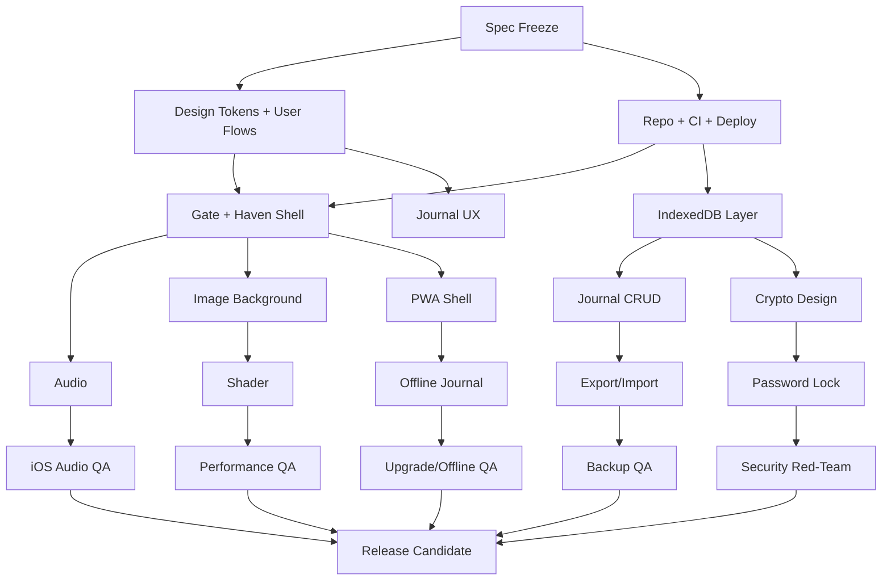

# Haven Art — Multi-Agent Delivery Plan
Version: 1.0
Date: 2026-09-30

> Mục tiêu: biến Haven Art MVP thành một dự án có thể được nhiều AI agent cùng thiết kế và triển khai song song, với ranh giới trách nhiệm, skill, đầu ra, tiêu chí nghiệm thu, handoff và cơ chế red-team rõ ràng.

---

## 0. North Star và các nguyên tắc bất biến

### North Star
Haven Art là một góc riêng trên web: người dùng bước vào, xem hình ảnh nghệ thuật dịu mắt, nghe nhạc thư thái, viết nhật ký/cảm nhận cục bộ trên thiết bị, và không bị thúc ép bởi notification, streak hay quảng cáo.

### Các nguyên tắc bất biến cho mọi agent
1. Local-first ở MVP: nội dung nhật ký không được gửi tới server.
2. Không có tài khoản/sync/share trong MVP.
3. Nhẹ, mobile-first, chạy tốt trên điện thoại tầm trung.
4. Không dùng Three.js; shader WebGL2 phải có fallback.
5. Không autoplay trước thao tác người dùng.
6. Ảnh và nhạc phải có license rõ ràng và credit.
7. Không được thêm SDK analytics bên thứ ba nếu SDK có khả năng đọc nội dung trang/nhật ký.
8. Không render nội dung nhật ký bằng `innerHTML`.
9. Mọi thay đổi liên quan crypto, storage migration, service worker hoặc xóa dữ liệu đều phải qua reviewer chuyên trách.
10. Mọi feature chỉ được coi là xong khi có test + acceptance evidence.

---

# 1. Mô hình tổ chức multi-agent

## 1.1 Agent hierarchy

Có 4 lớp:

- **L0 — Orchestrator**: điều phối công việc, dependency, merge gate và quyết định thứ tự.
- **L1 — Domain Lead Agents**: phụ trách từng miền chức năng.
- **L2 — Reviewer / Red-Team Agents**: không viết feature chính; chuyên tìm lỗi và phá giả định.
- **L3 — Utility Skills**: năng lực dùng lại mà nhiều agent gọi được.

Không để một agent vừa viết feature vừa tự phê duyệt feature đó.

---

# 2. Danh sách agent

## A0 — Orchestrator / Delivery Manager

### Mục tiêu
Biến spec thành work graph, phân task, phát hiện dependency, theo dõi tiến độ, chặn merge khi thiếu tiêu chí.

### Quyền
- Đọc toàn repo.
- Tạo issue/task.
- Không tự ý thay đổi product requirement.
- Không merge phần crypto/security nếu thiếu review A5 + A13.
- Không merge release nếu thiếu A10 + A12.

### Skill bắt buộc
- `spec-to-backlog`
- `dependency-graph`
- `acceptance-gate`
- `handoff-manager`
- `decision-log`
- `release-tracking`

### Đầu ra
- `/docs/plan/work-graph.md`
- `/docs/plan/sprint-board.md`
- `/docs/decisions/ADR-*.md`
- `/docs/status/daily.md`
- danh sách blocker và owner

### Definition of Done
- Mỗi task có owner, input, output, acceptance criteria.
- Không có task "làm UI", "làm backend" quá mơ hồ.
- Dependency DAG không có vòng lặp.
- Mỗi merge request có reviewer khác author.

---

## A1 — Product Spec Guardian

### Mục tiêu
Giữ cho sản phẩm không trượt khỏi MVP, chuyển requirement thành behavior cụ thể và testable.

### Phụ trách
- F1–F9 ở mức product behavior.
- Các quyết định Must / Should / Could.
- Copy liên quan privacy, backup, lock, data loss.
- Fake-door cho Phase 2 phải chỉ đếm click, không tạo sync thật.

### Skill
- `requirements-traceability`
- `user-story-writing`
- `acceptance-criteria`
- `scope-guard`
- `product-copy-review`

### Đầu ra
- `/docs/spec/requirements-matrix.md`
- `/docs/spec/user-flows.md`
- `/docs/spec/copy-contract.md`

### Cấm
- Không tự thêm social feed, cloud sync, login, AI journal analysis vào MVP.
- Không biến Should thành Must nếu chưa có quyết định.

---

## A2 — UX / UI / Design System Agent

### Mục tiêu
Thiết kế giao diện dịu, đơn giản, mobile-first, accessible.

### Phụ trách
- Gate
- Haven main experience
- Dock
- Write panel
- Journal list
- Settings
- Empty states
- Backup/import preview
- Lock/unlock flows
- Privacy warnings

### Skill
- `ux-flow-design`
- `design-tokens`
- `responsive-layout`
- `a11y-first-design`
- `motion-design`
- `content-hierarchy`

### Đầu ra
- `/docs/design/flows.md`
- `/docs/design/tokens.json`
- `/docs/design/components.md`
- wireframes / screenshots
- state table cho từng component

### Acceptance
Mỗi component phải mô tả đủ:
- normal
- hover/focus
- loading
- empty
- error
- reduced-motion
- keyboard behavior

---

## A3 — Frontend Shell / Interaction Agent

### Mục tiêu
Xây app shell bằng Astro + Svelte, navigation, component contracts, state wiring và lazy loading.

### Ownership
- `src/pages/**`
- `src/components/Gate*`
- `src/components/Haven*`
- `src/components/Dock*`
- layout + route shell

### Skill
- `astro-svelte`
- `typescript`
- `component-contracts`
- `code-splitting`
- `browser-events`
- `client-hydration`

### Không được ownership
- `src/lib/crypto/**`
- migration IndexedDB
- service worker policy
- test sign-off

### Acceptance
- JS khởi đầu theo budget.
- Không hydrate phần journal trước khi cần.
- Enter/Space dùng được ở Gate.
- Không có autoplay trước click/tap.

---

## A4 — Journal / Local Data Agent

### Mục tiêu
Xây journal CRUD, draft autosave, import/export, search và local persistence.

### Ownership
- `src/lib/db/**`
- `src/lib/export/**`
- `src/lib/search/**`
- Journal editor/list state

### Skill
- `indexeddb`
- `idb-migrations`
- `autosave`
- `import-export`
- `schema-validation`
- `text-normalization`
- `data-integrity`

### Công việc
- DB `haven`, schema v1.
- entries, drafts, meta.
- ULID.
- Autosave 2 giây sau idle.
- Undo delete 10 giây.
- JSON export/import có schema version.
- Preview import.
- Deduplicate theo id.
- Search không dấu.
- `navigator.storage.persist()` flow.

### Acceptance
- Reload không mất bài.
- Tab Network không có journal body/title/mood.
- Import lỗi không làm thay đổi DB.
- Export → fresh browser → import tạo dữ liệu tương đương.
- 10.000 ký tự không block UI đáng kể.

---

## A5 — Security / Crypto / Privacy Engineering Agent

### Mục tiêu
Thiết kế và review khóa mật khẩu, threat model, CSP và xử lý dữ liệu nhạy cảm.

### Ownership
- `src/lib/crypto/**`
- crypto format
- key lifecycle
- re-encryption transaction
- security headers proposal

### Skill
- `webcrypto`
- `aes-gcm`
- `pbkdf2`
- `key-management`
- `threat-modeling`
- `csp`
- `xss-review`
- `supply-chain-review`

### Quy tắc
- AES-GCM 256.
- IV 12 byte unique/random per ciphertext.
- Salt 16 byte.
- PBKDF2-SHA256 với iteration được cấu hình + versioned.
- CryptoKey non-extractable.
- Key chỉ ở RAM.
- Không log plaintext.
- Không lưu password.
- Lock timeout configurable.
- Re-encrypt phải atomic/recoverable.

### Đầu ra
- `/docs/security/threat-model.md`
- `/docs/security/crypto-format.md`
- `/docs/security/security-review.md`
- test vectors

### Merge gate
Bất kỳ code nào đụng:
- encryption
- export encrypted data
- migration encrypted DB
- password change
- erase-all
phải có A5 review + A13 adversarial review.

---

## A6 — Audio / Media Agent

### Mục tiêu
Xây hệ thống audio nhẹ, đúng autoplay policy, crossfade mượt, metadata rõ.

### Ownership
- `src/lib/audio/**`
- audio control UI contract
- Media Session adapter
- audio asset validation

### Skill
- `web-audio`
- `html-audio`
- `gain-node`
- `media-session`
- `audio-normalization`
- `browser-autoplay-policy`

### Acceptance
- Không tải audio trước “Bước vào”.
- Không phát trước user gesture.
- Mặc định 40%.
- Không có hai source phát cùng lúc.
- Crossfade ổn định.
- iOS fallback rõ ràng.
- Track metadata có credit.

---

## A7 — Visual / Shader / Performance Agent

### Mục tiêu
Xử lý slideshow, responsive image, shader WebGL2, adaptive quality và performance budget.

### Ownership
- `src/lib/visuals/**`
- `src/shaders/**`
- image loading strategy

### Skill
- `responsive-images`
- `avif-webp`
- `webgl2`
- `shader-optimization`
- `adaptive-render-scale`
- `performance-profiling`
- `prefers-reduced-motion`
- `save-data`

### Acceptance
- First-screen image <= budget đã định.
- Chỉ preload ảnh kế tiếp.
- CLS = 0 khi đổi ảnh.
- Reduced motion → static mode.
- WebGL fail → image fallback.
- Tab hidden → shader pause.
- DPR cap + adaptive scale.
- Target >= 50 fps trên thiết bị benchmark.

---

## A8 — PWA / Offline / Browser Platform Agent

### Mục tiêu
Làm PWA, service worker, offline shell, update flow và browser-specific behavior.

### Ownership
- PWA config
- service worker
- manifest
- offline cache strategy
- update UX

### Skill
- `workbox`
- `vite-pwa`
- `cache-strategy`
- `service-worker-lifecycle`
- `storage-persistence`
- `ios-safari`

### Acceptance
- Journal CRUD hoạt động offline.
- Shell cache được.
- Ảnh đã xem dùng offline nếu cache còn.
- Audio không cache mặc định.
- Update không ghi đè/mất local DB.
- Có thông báo “Có bản mới”.
- PWA install metadata hợp lệ.

---

## A9 — Content / Licensing / Credits Agent

### Mục tiêu
Chọn nội dung và bảo đảm provenance/license.

### Ownership
- `public/credits.json`
- asset license ledger
- alt text
- static content drafts

### Skill
- `license-audit`
- `asset-provenance`
- `alt-text`
- `content-curation`
- `copy-editing`

### Đầu ra
Mỗi asset phải có:
- id
- file
- author
- source_url
- license
- license_url
- downloadedAt
- checksum
- alt_vi

### Merge gate
Không asset nào được ship nếu thiếu license record.

---

## A10 — QA / Accessibility Agent

### Mục tiêu
Độc lập kiểm thử behavior, accessibility, regression và cross-browser.

### Ownership
- test plan
- Playwright
- Vitest review
- a11y audit
- device matrix

### Skill
- `vitest`
- `playwright`
- `webkit-testing`
- `keyboard-a11y`
- `screen-reader-review`
- `lighthouse`
- `regression-testing`

### Test matrix
- Chromium desktop
- Chromium Android
- Safari/iOS
- WebKit CI
- keyboard only
- reduced-motion
- offline
- Save-Data nếu test harness hỗ trợ

### Release gate
Không release nếu còn:
- P0/P1 bug
- data-loss bug
- crypto regression
- journal leak
- keyboard blocker
- service-worker upgrade corruption

---

## A11 — Privacy Analytics / Experiment Agent

### Mục tiêu
Đo hành vi mà không đụng nội dung nhật ký.

### Skill
- `privacy-analytics`
- `event-schema`
- `data-minimization`
- `fake-door-experiment`

### Event allowlist
Ví dụ:
- `gate_enter`
- `music_toggle`
- `journal_created`
- `backup_exported`
- `sync_fake_door_clicked`
- `share_fake_door_clicked`

### Không được gửi
- title
- body
- mood
- prompt answer
- search query
- password state chi tiết
- encryption metadata
- raw device identifier

### Đầu ra
- `/docs/analytics/event-schema.md`
- privacy review của từng event

---

## A12 — DevOps / CI / Release Agent

### Mục tiêu
Chuẩn hóa build, preview, CI, dependency hygiene và Cloudflare deployment.

### Skill
- `github-actions`
- `cloudflare-pages`
- `ci-quality-gates`
- `dependency-pinning`
- `npm-audit`
- `lighthouse-ci`
- `release-versioning`

### Pipeline bắt buộc
1. install locked deps
2. typecheck
3. lint
4. unit tests
5. build
6. Playwright Chromium
7. Playwright WebKit
8. Lighthouse CI
9. dependency/security checks
10. preview deploy

### Không tự động production deploy nếu chưa có release gate.

---

## A13 — Red-Team / Adversarial Reviewer

### Mục tiêu
Cố tình tìm cách làm hỏng sản phẩm trước người dùng.

### Skill
- `abuse-case-analysis`
- `data-loss-testing`
- `privacy-leak-testing`
- `crypto-misuse-review`
- `xss-review`
- `offline-upgrade-failure`
- `race-condition-testing`

### Kịch bản bắt buộc
- đóng tab giữa autosave
- kill browser giữa re-encrypt
- import file hỏng
- import file cực lớn
- wrong password nhiều lần
- service worker update giữa session
- IndexedDB quota failure
- xóa site data
- WebGL context lost
- audio play rejection
- duplicate tab edit
- CSP violation
- malformed metadata
- hostile journal text chứa HTML/script-like strings

---

# 3. Skill catalog dùng chung

Mỗi skill nên được biểu diễn bằng một file riêng trong `.agents/skills/`.

## S01 `spec-to-backlog`
Input: feature spec  
Output: atomic tasks + dependencies + AC  
Pass condition: mỗi task 2–8 giờ hoặc là một review gate.

## S02 `requirements-traceability`
Input: source requirement  
Output: Requirement ID → implementation → test mapping.

## S03 `astro-svelte`
Biết:
- Astro islands
- Svelte state
- client directives
- SSR/static boundary
- lazy hydration

## S04 `indexeddb`
Biết:
- transaction
- version upgrade
- compound failure
- quota error
- serialization
- durability caveats

## S05 `webcrypto`
Biết:
- subtle crypto APIs
- AES-GCM
- PBKDF2
- ArrayBuffer/base64 encoding
- unique IV
- memory-only key handling
- migration/versioning

## S06 `privacy-leak-audit`
Kiểm:
- Network
- console
- analytics payload
- crash/logging
- DOM exposure
- browser storage
- export file

## S07 `audio-browser`
Kiểm:
- autoplay
- Safari/iOS gesture restrictions
- loop/crossfade
- Media Session

## S08 `webgl2-performance`
Kiểm:
- shader compile
- precision
- context loss
- DPR
- fps
- background tab pause
- fallback

## S09 `pwa-offline`
Kiểm:
- precache
- runtime cache
- update
- cache invalidation
- offline navigation
- installability

## S10 `a11y`
Kiểm:
- keyboard
- focus order
- focus trap
- ARIA
- screen reader labels
- contrast
- reduced motion

## S11 `playwright`
Biết:
- Chromium/WebKit projects
- offline emulation
- network inspection
- storage reset
- accessibility assertions
- visual states

## S12 `license-audit`
Biết:
- provenance
- license terms
- attribution
- redistribution constraints
- audit ledger

## S13 `performance-budget`
Theo dõi:
- JS initial
- LCP
- CLS
- INP
- image bytes
- shader fps
- long tasks

## S14 `release-gate`
Tổng hợp:
- test pass
- performance pass
- a11y pass
- privacy pass
- security pass
- license pass

---

# 4. Repo layout cho multi-agent

```text
/
├─ .agents/
│  ├─ orchestrator.md
│  ├─ roles/
│  │  ├─ A1-product.md
│  │  ├─ A2-design.md
│  │  ├─ A3-frontend.md
│  │  ├─ A4-journal.md
│  │  ├─ A5-security.md
│  │  ├─ A6-audio.md
│  │  ├─ A7-visuals.md
│  │  ├─ A8-pwa.md
│  │  ├─ A9-content.md
│  │  ├─ A10-qa.md
│  │  ├─ A11-analytics.md
│  │  ├─ A12-devops.md
│  │  └─ A13-redteam.md
│  ├─ skills/
│  │  ├─ spec-to-backlog.md
│  │  ├─ indexeddb.md
│  │  ├─ webcrypto.md
│  │  ├─ pwa-offline.md
│  │  ├─ a11y.md
│  │  └─ ...
│  ├─ contracts/
│  │  ├─ task.schema.yaml
│  │  ├─ handoff.schema.yaml
│  │  └─ review.schema.yaml
│  └─ memory/
│     ├─ decisions.md
│     ├─ known-risks.md
│     └─ active-blockers.md
├─ docs/
│  ├─ spec/
│  ├─ design/
│  ├─ security/
│  ├─ analytics/
│  ├─ qa/
│  ├─ decisions/
│  └─ release/
├─ src/
├─ public/
└─ tests/
```

---

# 5. Contract giữa agent

## 5.1 Task contract

```yaml
id: E3.2
title: Journal editor + autosave
owner: A4
reviewers: [A1, A10]
depends_on: [E3.1]
inputs:
  - docs/spec/requirements-matrix.md#F4
  - src/lib/db/index.ts
outputs:
  - src/components/WritePanel.svelte
  - src/lib/db/drafts.ts
acceptance:
  - autosave after 2s idle
  - reload restores draft
  - no journal content in network requests
tests:
  - tests/journal/autosave.spec.ts
risk: medium
status: ready
```

## 5.2 Handoff contract

```yaml
task: E3.2
from: A4
to: A10
summary: Autosave implementation completed
changed:
  - src/components/WritePanel.svelte
  - src/lib/db/drafts.ts
known_limits:
  - duplicate-tab conflict not handled yet
test_command:
  - npm run test:journal
evidence:
  - test report path
questions:
  - verify tab-close recovery on WebKit
```

## 5.3 Review contract

Reviewer phải trả về:
- PASS
- PASS_WITH_FOLLOWUPS
- BLOCK

Không dùng câu mơ hồ kiểu “looks good”.

---

# 6. Quy tắc ownership để agent không giẫm chân nhau

1. Một file có một owner chính.
2. Reviewer không sửa trực tiếp feature branch nếu không được handoff.
3. Thay đổi cross-domain phải tạo mini-RFC.
4. Nếu A3 cần sửa crypto → yêu cầu A5.
5. Nếu A4 cần sửa service worker → yêu cầu A8.
6. Nếu A7 cần đổi UI component public API → báo A2 + A3.
7. Nếu A11 muốn thêm event mới → A5/A1 review data minimization.
8. Nếu A9 đổi asset → A7 kiểm budget ảnh/audio khi cần.
9. A12 không tự nâng major dependency trong tuần release.
10. A0 giải quyết conflict bằng ADR, không bằng merge “tạm”.

---

# 7. Work graph



---

# 8. Kế hoạch triển khai theo tuần

## Week 0 — Foundation & Design Freeze

### Song song
**A0**
- tạo work graph
- issue schema
- branch policy
- DoD

**A1**
- requirement matrix
- chốt Must/Should/Could
- ghi unresolved decisions

**A2**
- design tokens
- mobile layout
- Gate/Haven/Write flows

**A9**
- bắt đầu license ledger
- chọn asset candidates

**A12**
- repo
- CI
- Cloudflare preview
- typecheck/lint/test skeleton

### Gate cuối tuần
- production repo build được
- preview deploy được
- design tokens frozen v0.1
- 100% Must story có AC

---

## Week 1 — Gate + Visual Baseline

**A3**
- Gate component
- Haven shell
- keyboard behavior

**A7**
- responsive image pipeline
- slideshow
- static/reduced-motion

**A2**
- review final spacing/motion

**A10**
- keyboard smoke test
- Lighthouse baseline

### Gate
- vào Haven bằng click/Enter/Space
- no autoplay
- image swap không CLS
- reduced motion hoạt động

---

## Week 2 — Audio + Settings + PWA Shell

**A6**
- audio engine
- volume persistence
- crossfade
- Media Session

**A8**
- manifest
- installability
- service worker shell

**A3**
- Settings shell + control wiring

**A10**
- iOS/WebKit tests

### Gate
- audio chỉ bắt đầu sau gesture
- một source tại một thời điểm
- app shell offline
- update strategy được document

---

## Week 3 — Journal Core

**A4**
- IndexedDB v1
- editor
- autosave
- draft recovery
- list/edit/delete/undo

**A2**
- journal states
- empty/error copy

**A5**
- privacy leak review
- DB schema review

**A10**
- reload
- tab close
- offline CRUD
- 10k text
- hostile text

### Gate
- reload không mất bài
- Network không có journal content
- XSS-like strings render text
- offline CRUD pass

---

## Week 4 — Backup + Crypto + Static Pages

**A4**
- export/import JSON
- preview import
- dedupe
- backup reminder

**A5**
- password lock
- re-encryption flow
- auto-lock
- crypto format

**A9**
- Privacy / Credits / Support / About drafts

**A13**
- red-team data loss + crypto

### Gate
- export/import roundtrip pass
- wrong password fails cleanly
- interrupted re-encrypt does not destroy data
- plaintext không còn trong IndexedDB khi lock enabled

---

## Week 5 — Shader + Polish + Analytics

**A7**
- WebGL2 shader
- adaptive render scale
- context loss
- fallback

**A11**
- minimal event schema
- fake-door counters

**A10**
- accessibility full audit
- performance audit

**A9**
- final asset provenance

### Gate
- shader fallback pass
- perf budget gần target
- analytics payload inspected
- credits complete

---

## Week 6 — Release Candidate + Soft Launch

**A10**
- full regression
- real-device QA

**A13**
- final adversarial suite

**A12**
- release candidate
- production headers
- deploy gate

**A0**
- compile release evidence
- freeze non-critical changes

### Release criteria
- no P0/P1
- no known data-loss bug
- no known privacy leak
- crypto gate pass
- offline gate pass
- WebKit pass
- a11y blockers = 0
- license ledger complete
- recovery/backup copy clear

---

# 9. Feature-to-agent map

| Feature | Primary | Review |
|---|---|---|
| F1 Gate | A3 | A2, A10 |
| F2 Visual background | A7 | A2, A10 |
| F3 Music | A6 | A10 |
| F4 Journal | A4 | A1, A5, A10 |
| F5 Backup/restore | A4 | A5, A10, A13 |
| F6 Password lock | A5 | A10, A13 |
| F7 Settings | A3 | A2, A10 |
| F8 PWA/offline | A8 | A4, A10, A13 |
| F9 Static pages | A9 | A1, A5 |
| Analytics | A11 | A1, A5 |
| CI/Deploy | A12 | A10 |
| Release | A0 | A10, A12, A13 |

---

# 10. Prompt gốc cho Orchestrator

```text
You are the Haven Art Orchestrator.

Your job is not to implement everything yourself. Your job is to:
1. read the canonical product spec;
2. maintain the task/dependency graph;
3. assign each task to the correct domain agent;
4. require explicit acceptance evidence;
5. prevent scope creep;
6. require independent review for security, privacy, storage migrations and release;
7. update decision logs and blockers.

Non-negotiable product rules:
- MVP is local-first.
- Journal content must never be sent to a server.
- No login/sync/share in MVP.
- No autoplay before user gesture.
- No innerHTML for journal content.
- Every image/audio asset needs a license record.
- Reduced-motion and mobile performance are first-class requirements.
- Crypto/storage/service-worker changes require specialist review.

When creating a task, always produce:
ID, owner, reviewers, dependencies, inputs, outputs, acceptance criteria, tests, risk, and handoff target.

Never mark DONE from code completion alone. DONE requires test/review evidence.
```

---

# 11. Prompt template cho mọi specialist agent

```text
ROLE:
You are agent {AGENT_ID}: {ROLE_NAME} for Haven Art.

MISSION:
{MISSION}

OWNERSHIP:
{OWNED_PATHS_AND_FEATURES}

DO NOT:
- change product scope;
- edit files outside ownership without a handoff/RFC;
- weaken privacy/performance/accessibility requirements;
- claim completion without evidence.

PROCESS:
1. Read canonical spec and active task.
2. Read decisions and known risks.
3. Inspect existing implementation before editing.
4. Propose a minimal plan.
5. Implement only assigned scope.
6. Add/update tests.
7. Run relevant checks.
8. Produce a handoff report.

HANDOFF FORMAT:
- task id
- summary
- files changed
- tests run
- evidence
- known limitations
- risks
- questions for reviewer

STOP CONDITIONS:
If the task conflicts with canonical requirements, stop and raise BLOCKER.
If sensitive data could leave the device, stop and require privacy/security review.
```

---

# 12. Prompt cho Red-Team

```text
You are the adversarial reviewer for Haven Art.

Assume the feature appears to work. Your job is to make it fail.

Prioritize:
1. data loss;
2. privacy leakage;
3. crypto misuse;
4. XSS/content injection;
5. offline/update corruption;
6. browser incompatibility;
7. race conditions;
8. misleading privacy copy.

For each finding return:
- severity: P0/P1/P2/P3
- reproduction steps
- expected vs actual
- affected data
- whether user data can be lost/exposed
- recommended fix boundary
- regression test that must be added

Do not approve based on code style or happy-path tests.
```

---

# 13. Review gates

## G1 — Product gate
Owner: A1  
Pass khi requirement trace đầy đủ.

## G2 — Design gate
Owner: A2 + A10  
Pass khi keyboard/reduced-motion states được thiết kế.

## G3 — Data gate
Owner: A4 + A5  
Pass khi DB schema, migrations, import/export an toàn.

## G4 — Security gate
Owner: A5 + A13  
Pass khi crypto/threat tests sạch.

## G5 — Offline gate
Owner: A8 + A10 + A13  
Pass khi SW upgrade không gây mất dữ liệu.

## G6 — Performance gate
Owner: A7 + A10  
Pass khi budget đạt hoặc deviation được chấp thuận bằng ADR.

## G7 — Release gate
Owner: A0 + A10 + A12 + A13  
Pass mới production deploy.

---

# 14. Severity model

## P0
- mất dữ liệu diện rộng
- plaintext journal gửi ra network
- bypass encryption
- delete-all không xác nhận đúng
- production inaccessible

## P1
- mất một phần dữ liệu
- import corrupt data
- password change phá vault
- offline upgrade phá app
- journal không dùng được trên Safari/iOS mục tiêu

## P2
- chức năng chính lỗi nhưng có workaround
- performance vượt budget đáng kể
- keyboard issue không block toàn app

## P3
- polish
- copy
- minor visual defect

Production block với P0/P1.

---

# 15. Definition of Done toàn dự án

Một feature chỉ DONE khi:
1. Requirement ID có trace.
2. Code đúng ownership.
3. Typecheck/lint pass.
4. Unit/integration test pass.
5. Browser test cần thiết pass.
6. Accessibility state được kiểm.
7. Network/privacy check được kiểm nếu có data.
8. Performance check được kiểm nếu có media/rendering.
9. Reviewer độc lập PASS.
10. Handoff + decision log được cập nhật.

---

# 16. Bộ test tối thiểu bắt buộc

## Journal
- create
- edit
- autosave
- reload restore
- delete + undo
- permanent delete
- 10k chars
- Unicode tiếng Việt
- HTML/script-like input
- offline

## Backup
- empty export
- normal export
- large export
- malformed JSON
- wrong schema
- duplicate IDs
- partial failure
- roundtrip

## Crypto
- correct password
- wrong password
- unique IV
- auto lock
- page refresh
- re-encrypt on change password
- interrupted re-encrypt
- encrypted draft
- no plaintext at rest

## Audio
- no pre-gesture load/play
- rejected play promise
- track switch
- crossfade
- background tab
- iOS gesture

## Visual
- reduced motion
- Save-Data
- WebGL unavailable
- context loss
- background tab pause
- adaptive scale

## PWA
- first install
- offline revisit
- stale cache
- SW update
- storage clear
- app shell missing network
- journal DB preserved across deploy

---

# 17. Performance budget contract

Không merge feature làm vượt budget mà không có ADR.

Theo dõi:
- initial JS gzip
- first image bytes
- LCP
- CLS
- INP
- long tasks
- shader FPS
- total memory rough trend
- audio asset size

Mỗi PR tác động bundle/media phải ghi trước/sau.

---

# 18. Privacy contract

Các agent phải mặc định:
- data minimization
- no content telemetry
- no console plaintext in production
- no third-party script on journal page
- no session replay
- no remote error reporter chứa state người dùng nếu chưa được scrub tuyệt đối
- export/import hoàn toàn local
- support page không tự gửi nội dung journal

A5 có quyền block bất kỳ dependency nào quan sát DOM hoặc network ngoài mục đích đã chốt.

---

# 19. Decision log bắt buộc

Mỗi quyết định sau phải có ADR:
- có/không password lock trong MVP
- iteration PBKDF2 cuối cùng
- analytics provider
- shader quality strategy
- service-worker update strategy
- backup reminder behavior
- framework deviation
- dependency lớn mới
- asset license ngoại lệ
- performance budget exception

ADR format:

```text
ADR-00X: Title
Status:
Context:
Decision:
Alternatives:
Security/privacy impact:
Performance impact:
Migration impact:
Rollback:
Owners:
```

---

# 20. Cách chạy nhiều agent thực tế

## Khuyến nghị concurrency
Chạy tối đa 4–6 agent viết code đồng thời. Nhiều hơn sẽ tăng merge conflict hơn tốc độ.

### Nhóm song song hiệu quả
**Lane 1 — Product/Design**
A1 + A2 + A9

**Lane 2 — App**
A3 + A4

**Lane 3 — Platform**
A6 + A7 + A8

**Lane 4 — Assurance**
A5 + A10 + A13

**Lane 5 — Delivery**
A0 + A12

Reviewer có thể chạy liên tục nhưng chỉ review artifact đã handoff.

---

# 21. Memory mà agent phải chia sẻ

Không chia sẻ toàn bộ chat history. Dùng shared project memory có cấu trúc:

`decisions.md`
- quyết định đã chốt

`known-risks.md`
- risk còn mở

`active-blockers.md`
- blocker hiện tại

`interfaces.md`
- public API giữa module

`schema.md`
- IndexedDB + export schema

`test-matrix.md`
- coverage hiện tại

`release-status.md`
- gate status

Mỗi agent đọc các file này trước khi làm task.

---

# 22. Interface contracts quan trọng

## Journal repository
A4 cung cấp API ổn định cho UI:
- `createEntry`
- `updateEntry`
- `getEntry`
- `listEntries`
- `softDeleteEntry`
- `undoDelete`
- `purgeExpiredDeletes`

A3 không chạm trực tiếp IndexedDB.

## Crypto wrapper
A5 cung cấp:
- `unlock`
- `lock`
- `encryptRecord`
- `decryptRecord`
- `rotateKey`
- `isLocked`

A4 gọi API, không tự triển khai crypto primitive.

## Audio controller
A6 cung cấp:
- `unlockAudio`
- `play`
- `pause`
- `setVolume`
- `nextTrack`
- `destroy`

UI không giữ AudioContext trực tiếp.

## Visual controller
A7 cung cấp:
- `setVisualMode`
- `pauseVisuals`
- `resumeVisuals`
- `getCurrentCredit`

---

# 23. Branch / PR strategy

Branch:
- `feat/E3.2-journal-autosave`
- `fix/P1-import-corruption`
- `review/security-E4.3`

PR phải ghi:
- task ID
- owner
- reviewer
- requirement
- screenshots nếu UI
- tests
- performance delta nếu có
- privacy impact
- rollback plan nếu storage/service-worker/crypto

Không merge PR có thay đổi DB schema mà không bump/version/migration review.

---

# 24. Những việc không nên giao hoàn toàn cho AI agent

Cần con người duyệt cuối:
1. lựa chọn mood/art direction;
2. quyền sử dụng ảnh/nhạc khi license không hoàn toàn rõ;
3. nội dung trang hỗ trợ sức khỏe tinh thần;
4. privacy wording có thể bị hiểu sai;
5. soft-launch feedback;
6. quyết định có ship password lock trong MVP hay không;
7. production release.

AI có thể chuẩn bị phương án và evidence, nhưng người chịu trách nhiệm sản phẩm nên chốt.

---

# 25. Thứ tự khởi động đề xuất

Bước 1: tạo `.agents/`, `docs/`, contracts.  
Bước 2: chạy A1 để tạo requirement matrix.  
Bước 3: chạy A0 để biến matrix thành DAG.  
Bước 4: chạy A2 + A12 song song.  
Bước 5: sau design contract, mở A3/A7.  
Bước 6: sau DB contract, mở A4/A5.  
Bước 7: sau app shell, mở A6/A8.  
Bước 8: A10 test liên tục từ tuần 1.  
Bước 9: A13 bắt đầu từ lần đầu có dữ liệu persistent, không đợi cuối dự án.  
Bước 10: chỉ tạo RC khi tất cả gate xanh.

---

# 26. Bộ deliverable cuối cùng

Trước soft launch phải có:

- Product requirement matrix
- User-flow spec
- Design tokens
- Component states
- DB schema
- Export schema
- Crypto format
- Threat model
- Privacy event schema
- License ledger
- PWA caching policy
- Browser/device matrix
- Test report
- Performance report
- Accessibility report
- Known issues
- Release checklist
- Rollback procedure
- Backup/recovery user copy

---

# 27. Mục tiêu vận hành

Hệ multi-agent được coi là tốt nếu:
- agent có thể thay nhau mà không mất context;
- mỗi domain có owner rõ;
- decision không nằm trong chat tản mạn;
- merge conflict ít;
- regression được phát hiện trước release;
- security/privacy không phụ thuộc vào lời hứa;
- mọi feature có evidence, không chỉ “agent nói đã xong”.

Đây là điểm quan trọng nhất: **agent không phải đơn vị tin cậy; artifact, test, review và gate mới là đơn vị tin cậy.**
